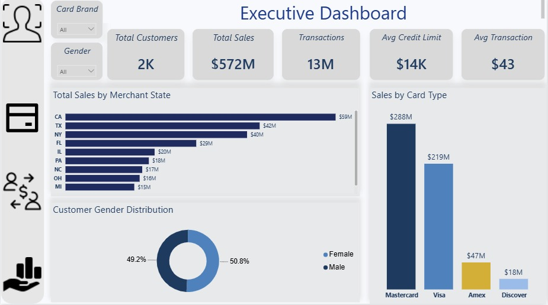
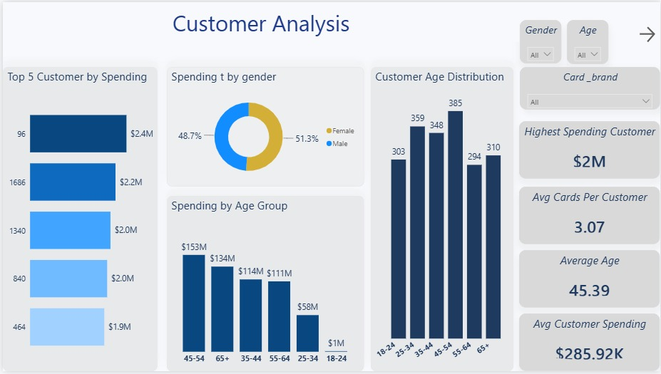
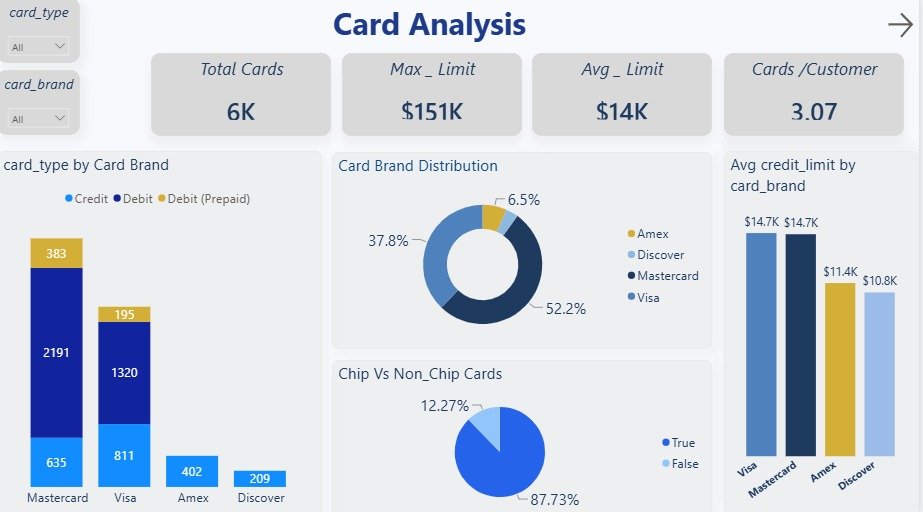
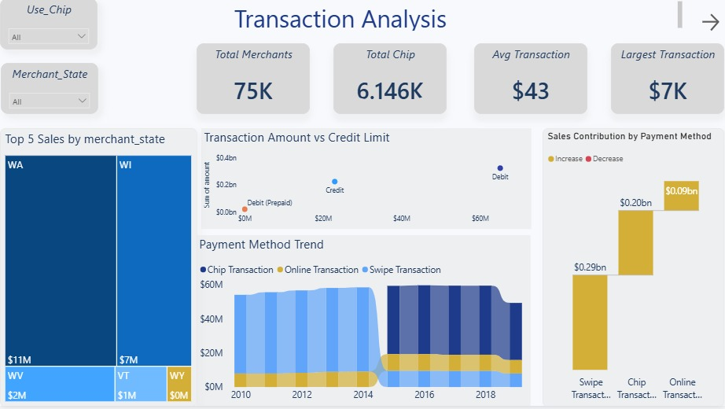
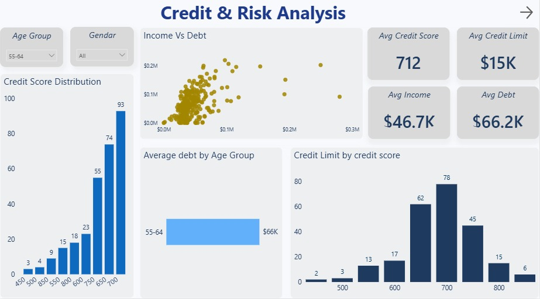

# 🏦 Bank Customer Analytics Dashboard

## 📌 Project Overview
This project presents an interactive banking analytics dashboard built using Power BI to analyze customer behavior, credit risk, transactions, and executive KPIs.

---

## 🛠 Tools Used
- Power BI
- SQL
- Python
- Excel

---

## 📊 Dashboard Pages

### Executive Dashboard

### Customer Analysis

### Card Analysis

### Transaction Analysis

### Credit & Risk Analysis

---

## 🎥 Dashboard Demo

demo.mp4

---

## 📄 Dashboard PDF

Dashboard.pdf

---

## 👩‍💻 Author

**Fatma Ali Hamouda**

LinkedIn:
https://www.linkedin.com/in/fatma-ali-b4997525b
Update READM
